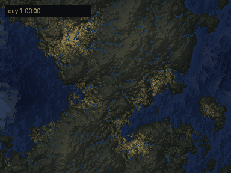
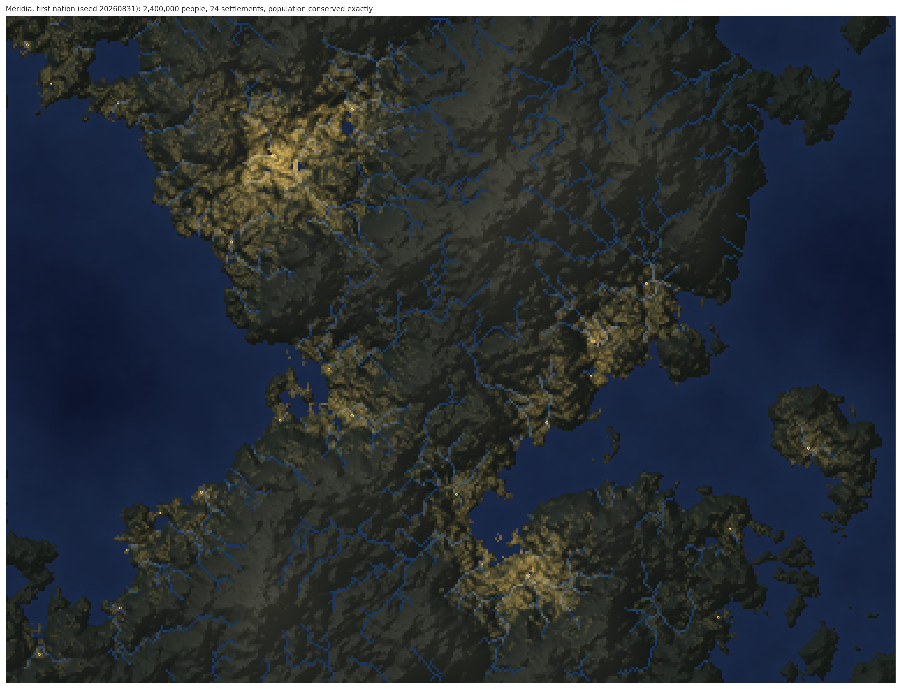
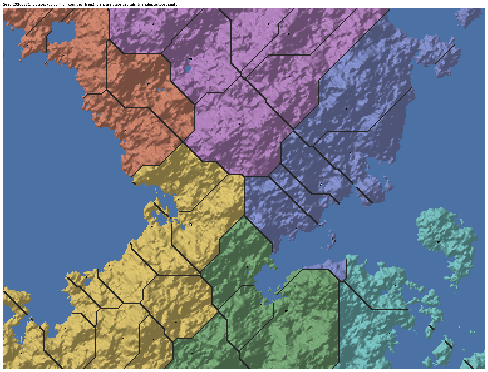
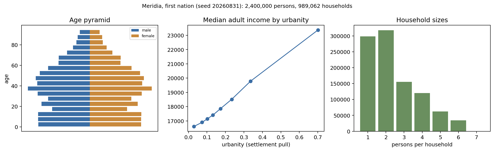
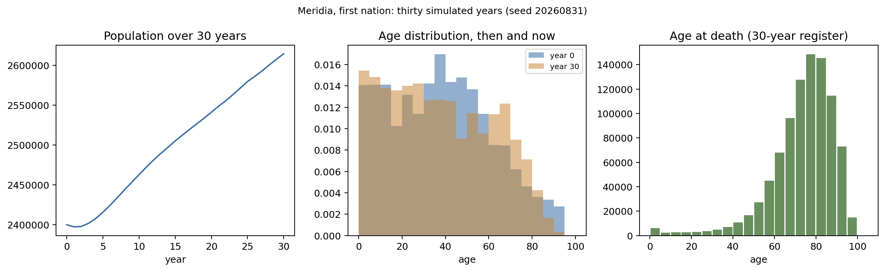
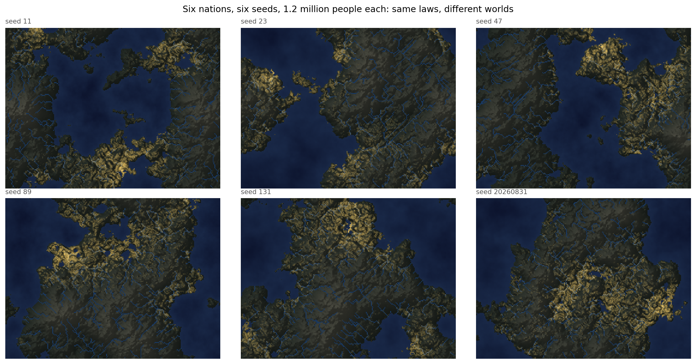

# Meridia

Meridia generates synthetic countries for testing statistical methods and AI research
agents. One seed produces terrain, rivers, settlements, and a population of individual
people with households, ages, and incomes; the national population size is drawn from
the seed as well, so nations differ in scale the way countries do. Surveys are then
drawn from that population, and the survey files carry the flaws real collection
produces. Households skip the survey, questions go unanswered, incomes are misreported,
ages get rounded. Because the complete population is retained,
the error of any estimate computed from a survey is known exactly, and stated
uncertainty can be checked against true coverage. No judge models, no real data.

The intended use is population science on a world whose truth is known: the world is
observed imperfectly through surveys and archives; a method reconciles, edits, and
imputes the sources; estimates and projections are published with uncertainty; retained
truth decides whether they held. Version three of the sources ships no exact
cross-source person key, draws the mechanism rates per world with a hidden shift
family outside the development band, and adds a separately biased benchmark series for
the national and state counts (`docs/RELEASE_CONTRACT_V0.md`, "Sources in version
three"). Each stage
of that chain is a benchmark task; the world keeps them mutually consistent.



*Three simulated days. Weather is state, not decoration: a wind field advects moisture,
mountains wring rain out of it, the rain routes down the verified drainage tree and the
rivers swell afterward, and the cities light up at night. Every frame is drawn from
stored world state.*



*The first nation, seed 20260831. Its 2,400,000 people shown as light: cities sit on
coasts and rivers, the mountain interior is empty.*

## What exists so far

- **Terrain.** Seeded elevation with mountain chains and a coast.
- **Rivers.** Water routing where every unit of runoff is accounted for, exactly,
  with a test proving it.
- **Census.** People are placed where land is livable (low, flat, near water), with
  bigger and smaller cities. The map's cell counts add up to the national total exactly,
  to the person.
- **People.** 2,400,000 persons in 989,062 households. Ages fit household roles, spouses
  have similar ages, and cities are richer and more educated than the countryside.
- **Surveys.** A sample drawn the way real surveys are drawn (by region, then area, then
  household), with recorded selection probabilities. On top of the clean sample:
  richer households respond less, income questions go unanswered more when income is
  high, reported incomes are a bit wrong, and ages get rounded to fives. The survey file
  shows only what respondents reported; the truth stays on file for grading.

- **Weather.** A wind field advects moisture; the sea recharges it; slopes facing the
  wind get the rain (tested); routed precipitation makes river discharge rise with a
  lag after storms (tested). This is the layer that will drive storm-related data
  collection failures in survey tasks.
- **Years passing.** The country ages: everyone gets older, deaths follow an
  age-specific mortality curve, babies join their mother's household, and young adults
  leave home, mostly for the cities. Every event lands in a vital-events register, and
  next year's population equals this year's plus births minus deaths, exactly. Thirty
  years of 2.4 million people simulate in about ten seconds.

- **States and counties.** The land is partitioned into states and counties around the
  settlements and outposts, exactly: every person is in one county and one state, and
  counts add up through the hierarchy to the person. Outposts become the small remote
  counties an estimate table must still cover.
- **The release contract.** What a published estimate table must contain (eight estimands at
  nation, state, and county level, with intervals, plus a detailed table under disclosure
  control), and the scorer that judges it against the retained population: worst-unit
  error, interval coverage with a proper interval score, additivity, and a disclosure audit
  that solves for protected cells from any published totals. `docs/RELEASE_CONTRACT_V0.md`.









Worlds differ socially as well as physically. Each seed draws the society's parameters
from declared ranges: how unequal income is, how wealth concentrates in cities, how
young or old the population runs, how dominant the largest city is. Across a handful of
seeds that yields nations from 280 thousand to 1.6 million people, Gini coefficients
from 0.40 to 0.55, and life expectancies from 69 to 78. The ranges are public; a sealed
evaluation world's specific draw is not, so a method must estimate the society it is in
from the data.

## What a cheap world allows

Because a nation costs seconds, the unit of replication stops being a sample and becomes
the whole world. Studies that real data cannot support become routine.

- Run an estimator, or an AI research agent, across two hundred seeded nations and you
  have the sampling distribution of the whole workflow, from editing through inference,
  scored against exact truth in every world.
- Worlds can branch. The same nation with and without a break year (a mortality spike, a
  migration wave) turns behaviour under a shift into a controlled experiment, because the
  counterfactual world is on disk.
- Whether a proposed experiment can detect what it claims is answered by generating worlds
  under both hypotheses and counting, before any real compute is spent.
- Agent runs on world tasks carry rewards computed against exact truth, with no judge
  models and no label noise.

Evaluation stays clean through sealing: development worlds are open instruments; worlds
used for grading are generated at registered seeds and never looked at, by anyone.

## Rules the code follows

- Independent research on synthetic worlds; every method is from the public literature
  and cited where it is used. See [docs/INDEPENDENCE.md](docs/INDEPENDENCE.md).

- Same seed, same world, byte for byte.
- Plain Python with NumPy. No game engines, no third-party simulators, no real data.
- Totals are exact integers, and the conservation checks are tests, not intentions.
- The flaws in the survey data are planted through explicit mechanisms that are kept on
  file, so a method that models the mechanism is rewarded for it.
- Worlds used for sealed evaluation are generated at registered seeds and never looked
  at, by anyone.

## Run it

```bash
python -m pytest tests/
```

Seventy-five tests. Each script under `scripts/` draws one figure from stored state:
`render_first_nation.py` the terrain and rivers, `render_first_nation_population.py` the
population, `render_admin.py` the states and counties, `build_first_nation_microdata.py`
the people and households, `render_72_hours.py` three days of weather,
`run_thirty_years.py` thirty years of the country, `render_many_nations.py` six worlds,
and `world_characters.py` the character sheet of five societies.

Python 3.11+, NumPy, pandas, matplotlib, Pillow.

## Planned

The full build order is in [docs/ROADMAP.md](docs/ROADMAP.md).

Administrative registers with known linkage truth (the
vital-events register is the start). Epidemics and commuting. More nations, including
sealed ones.
