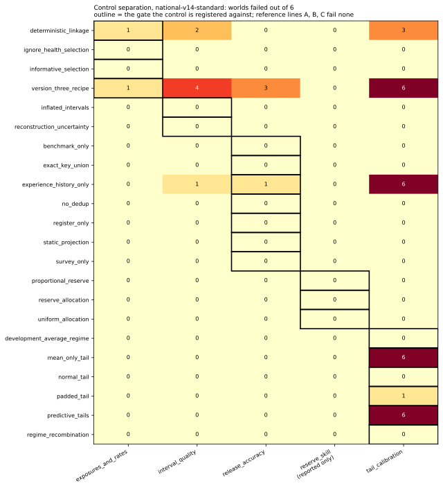

# Meridia

Robert Sneiderman, independent research. robbysneiderman@gmail.com

Meridia generates synthetic countries for testing statistical methods. One seed produces
terrain, rivers, settlements, and a population of individual people with households, ages,
incomes, employers, and health histories. Surveys and registers drawn from that population
carry the flaws real collection produces, from nonresponse and heaped ages to identifiers
that split and merge across sources. Because the complete population is retained, the
error of any estimate is known exactly, and stated uncertainty can be checked against true
coverage. No judge models, no real data.


*Three simulated days: moisture advects, mountains wring rain out of it, and rivers swell
after it routes down the drainage tree.*

## Install

CPython 3.13.13 with NumPy 2.4.4, pandas 3.0.3, SciPy 1.17.1, Matplotlib 3.10.9, Pillow
12.2.0, and pytest 9.0.3, pinned in `requirements-lock.txt`. The pins are exact because
the sealed manifests bind to them: `meridia/sealing.py` records the interpreter, the
platform, and the NumPy and pandas versions into every seal, and confirmation at
`meridia/sealing.py:632` refuses a world generated under any other runtime. A newer
runtime runs the generator and the verifier but cannot confirm a seal.

```bash
python -m venv .venv
source .venv/bin/activate
pip install -r requirements-lock.txt
```

Confirm the tree is sound.

```bash
python -m pytest tests/
```

That collects 679 tests, the count `python -m pytest tests/ --collect-only -q` reports
here. They are the specification rather than a smoke check. Conservation identities are
asserted in `tests/test_population.py` and `tests/test_demography.py`, determinism in
`tests/test_build_v4_worlds.py`, and every frozen threshold in
`tests/test_freeze_v4_composites.py`.

## Build a world

```bash
python scripts/build_v4_worlds.py --out worlds --family development --world-workers 4
```

That writes twelve development worlds under `worlds/development/dev-00` through `dev-11`,
one per row of the committed design in `meridia/mechanisms.py`. Development worlds are the
ones a method may tune on: they ship with their truth and their seeds are in the script.
The other families are `qualification`, the six worlds the bars are calibrated on, and
`graded`, the sealed set. Neither carries its seeds here. Both read them from a JSON file
outside the repository, at the path `MERIDIA_QUALIFICATION_SEED_FILE` names or at
`~/.config/meridia/v4_qualification_seeds.json`, and every refusal on that path names the
file and the fault without printing a seed.

Each world holds a `participant/` tree and a truth tree beside it. The participant tree is
all a method may read, including `contract.json`, which publishes the schema, the public
parameter ranges, and every threshold scored. No participant file carries a truth column,
and every world is a deterministic function of its seed.

## Run the verifier

The shortest end-to-end path builds a forty-thousand-person world, runs one reference line
on its participant files, and scores the result.

```bash
python scripts/demo_verify.py
```

```text
building one miniature development world ...
running reference line A on the participant files ...
submission files: projection.csv, release.csv, reserve.csv

metrics
  children_under_16/all                    worst 0.3947  mean 0.0842  coverage 0.95  iscore 0.7436
  ...
reserve feasible=True loss=nan skill=nan
gate profile standard
PASS
```

That is seventy-three lines: one row per estimand and level, then the reserve line, the
profile, and the verdict. The world is a miniature, forty thousand people rather than the
2,400,000 of a graded world, so it demonstrates the chain rather than standing as a scored
run. The two reserve values read `nan` because the reserve block is reported and not gated
under this profile, which `tests/test_undefined_reserve_skill.py` asserts.

A submission is what a method writes. Both reference lines take a packet directory and an
output directory and write the three files themselves, through
`design_based.run(packet_dir, out_dir, MethodParams(...))` in
`meridia/methods/design_based.py` and the same call in `meridia/methods/bayesian.py`.

`meridia/verify.py` reads a packet directory, a submission directory, and a bar set, and
returns a report. It does not inspect the method, and a submission need not import
anything from this repository.

```python
from pathlib import Path
import json

from meridia.verify import verify_submission, summary_table

bars = json.loads(Path("bars/national-v14-standard/bars.json").read_text())
report = verify_submission(
    Path("worlds/development/dev-00"),
    Path("submission"),
    bars=bars,
    gate_profile="standard",
)
print(summary_table(report))
```

A submission directory holds exactly three regular files: `release.csv` for the
population, exposure, and rate release, `projection.csv` for the horizon values, and
`reserve.csv` for the regional liability distribution and allocation. Headers are
fixed in `docs/SUBMISSION_FORMAT.md`; any extra entry, subdirectory, or symbolic link
fails the file check before a number is read.

Schema, additivity through the geographic hierarchy, and reserve feasibility are
deterministic hard checks. The stochastic verdict is five composite pass events:
`exposures_and_rates`, `release_accuracy`, `interval_quality`, `tail_calibration`, and
`reserve_skill`. All five are computed and reported on every run, and the gate profile
names which decide. A receipt frozen under one profile does not decide under any other.

## Where the bars are

Frozen thresholds live in `bars/`, one directory per freeze. `bars/national-v14-standard`
is the shipping set and the only version-four set recording `"frozen": true`. It carries
five files: `bars.json`, `PROVENANCE.md` naming the worlds and witnesses behind every bar,
`freeze_report.txt`, and the two reserve audits, `reserve_calibration_accepted.json` and
`reserve_qualification_audit.json`, which carry the candidate ladder and the accepted rate.

Under the `standard` profile four blocks decide, being exposures and rates, release
accuracy, interval quality, and tail calibration, on seven components in all. Three of the
four are validity gates: the reference lines clear them and none of the twenty-two
registered wrong methods in `meridia/methods/controls.py` fails them on every qualification
world. Tail calibration is the one block that separates, and it separates two of the
twenty-two. `freeze_report.txt` names which. That is the honest measure of what this bar
set discriminates, and raising it is the open work.

The reserve block is measured and reported whole and decides nothing. Its shortfall
probability bar sits at the ceiling of its attainable range, so the component cannot fail,
and at the compiled rate the reference allocations lose to a proportional baseline on ten
of the eighteen final reports, so a bar drawn from the reference spread would sit above the
baseline.



*Twenty-two registered controls against five composite gates over six qualification worlds,
drawn from `control_support.matrix` in `bars/national-v14-standard/bars.json`. Each cell is
the number of worlds that control fails that gate on, and the outline marks the gate it is
registered against. Only `mean_only_tail` and `predictive_tails` fail their registered gate
on all six worlds; the rest do not separate, which is what `full_separation: false` records
in the same file.*

Each bar is the `ceil(0.99 * 102)` order statistic, rank 101 of the 102 replicates of the
worst of three reference lines for that component, never the best line and never pooled, at
a target false-fail rate of one percent per component. The lines are design-based,
Bayesian, and a third with its own elder exposure, linkage, and mortality choices, all
under `meridia/methods/`; `docs/INDEPENDENCE.md` states how much independence that leaves.
`bars.json` carries the freeze's own caveats, including that six qualification worlds do
not establish a one percent rate on new worlds. The `lite` set reads the same evidence
under its own profile. The `full` set refuses on
`reserve_skill/worst_regional_shortfall_probability` before evidence is compiled and
carries no bars.

## Reproduce the freeze

```bash
export MERIDIA_QUALIFICATION_SEED_FILE=~/.config/meridia/v4_qualification_seeds.json
export W=./worlds
```

Build both families with the command in "Build a world", once with `--family development`
and once with `--family qualification`, writing into `$W`. Then compile the evidence and
read it under the shipping profile.

```bash
python scripts/build_v4_freeze_evidence.py \
    --development-root $W/development --qualification-root $W/qualification \
    --out ./evidence

python scripts/freeze_v4_bars.py \
    --evidence ./evidence/freeze_evidence_manifest.json \
    --gate-profile standard --out ./bars-rebuilt/national-v14-standard
```

`scripts/identifiability_v4.py` writes the preflight receipt the evidence pass reads, and
`scripts/seal_v4_worlds.py` registers a seal manifest. The reserve-rate measurements the
freeze depends on are `scripts/calibrate_reserve_rate.py`,
`scripts/sweep_reserve_rate_joint.py`, `scripts/red_team_reserve_total.py`, and
`scripts/reserve_decision_value.py`. Twelve full-scale worlds take hours and tens of
gigabytes, so build one family at a time.

## Sealing

No seed of a graded world is in this repository. Seeds are read from a file outside the
tree and derived inside the sealed builder through a keyed digest of a master secret that
is never committed, so no seed reaches a tracked file, a participant file, or a build log.
The manifests in `seals/` record, per world index, only the digests of the generated
layers and a commitment over them; generation runs headless and returns digests and
nothing else. Anyone holding a manifest can confirm a graded world is byte-identical to
the one sealed on registration day; nobody without the secret can regenerate it.


*The first nation, seed 20260831, rendered at a fixed 2,400,000 people so the figures
across this README stay comparable; the constant is `TOTAL` at
`scripts/render_first_nation_population.py:15`. Each seed draws its own national total and
its society from the public ranges in `meridia/character.py`; a sealed world's draw is not
public.*

## Documents

- `docs/DESIGN.md`: the world, the gates, the freeze, and what is gated against what is
  reported.
- `docs/SUBMISSION_FORMAT.md`: files, headers, column rules.
- `docs/IDENTITY_AND_SCHEMA_V0.md`: identities and schemas.
- `docs/INDEPENDENCE.md`: every method's public source, at its point of use.
- `docs/REVIEWER_GATES.md`: the two ways a synthetic benchmark usually fails, and the
  artifact that closes each here.
- `docs/ROADMAP.md`: what is not here yet.
- `docs/history/`: the dated record behind the current freeze.

## Independence

Meridia is independent research by Robert Sneiderman. Every world is synthetic, generated
here from a seed. No real microdata, administrative records, or survey responses were
used. The library is about thirty thousand lines of Python across thirty-nine modules,
with sixteen thousand lines of tests.

## License

Apache License 2.0. See `LICENSE`.
