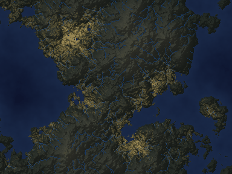

# Meridia

A generator for made-up countries where every number has a known true answer.

One seed produces a nation: mountains, rivers, cities, and 2.4 million simulated people
with ages, households, and incomes. It then produces survey data about those people with
the flaws real survey data has: people who refuse to answer, wrong answers, missing
values. The generator keeps the true value of everything it makes, so any estimate
computed from the survey data can be checked exactly.

That is the point. Statistical methods and AI research agents can be tested on this
data, and the grading is against true values, not against another model's opinion.



*One simulated day. Sunlight crosses the map from east to west; at night the cities
light up. Every frame is drawn from the same arrays the tests check.*


*The first nation, seed 20260831. Its 2,400,000 people shown as light: cities sit on
coasts and rivers, the mountain interior is empty.*

## What exists so far

- **Terrain.** Seeded elevation with mountain chains and a coast.
- **Rivers.** Water routing where every unit of runoff is accounted for. The books
  balance exactly and a test proves it.
- **Census.** People are placed where land is livable (low, flat, near water), with
  bigger and smaller cities. The map's cell counts add up to the national total exactly,
  to the person.
- **People.** 2,400,000 persons in 989,062 households. Ages fit household roles, spouses
  have similar ages, and cities are richer and more educated than the countryside.
- **Surveys.** A sample drawn the way real surveys are drawn (by region, then area, then
  household), with recorded selection probabilities. On top of the clean sample:
  richer households respond less, income questions go unanswered more when income is
  high, reported incomes are a bit wrong, and ages get rounded to fives. The survey file
  shows only what respondents reported; the truth stays on file for grading.


## Rules the code follows

- Same seed, same world, byte for byte.
- Plain Python with NumPy. No game engines, no third-party simulators, no real data.
- Totals are exact integers, and the conservation checks are tests, not intentions.
- The flaws in the survey data are planted through explicit mechanisms that are kept on
  file, so a method that models the mechanism genuinely wins.
- Worlds used for sealed evaluation are generated at registered seeds and never looked
  at, by anyone.

## Run it

```bash
python -m pytest tests/                        # 26 tests
python scripts/render_first_nation.py          # terrain and rivers map
python scripts/render_first_nation_population.py   # population map
python scripts/build_first_nation_microdata.py     # people, households, demographics
python scripts/render_day_night.py             # the day animation
```

Python 3.11+, NumPy, pandas, matplotlib, Pillow.

## Planned

Weather and climate. Births, deaths, and migration, so the country ages year by year.
Administrative registers with known linkage truth. Epidemics and commuting. More
nations, including sealed ones.
